# Blue Air App 

Blue Air is air quality checker app which is implemented in kotlin and Jetpack Compose. It fetches air quality data from __[Aqicn](https://aqicn.org/api/)__

## Preview

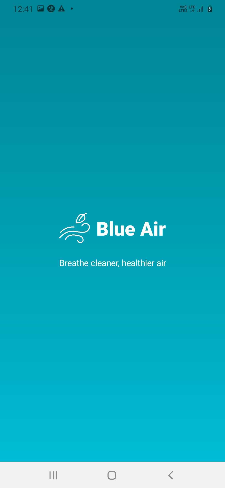
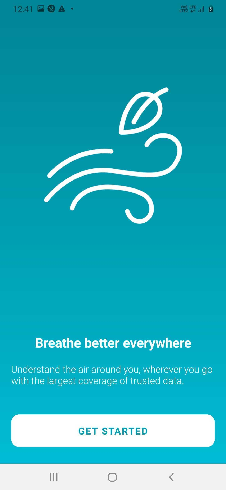
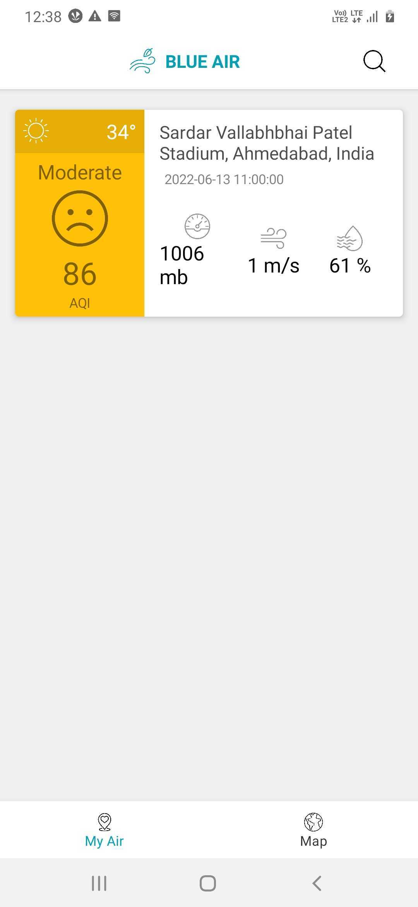
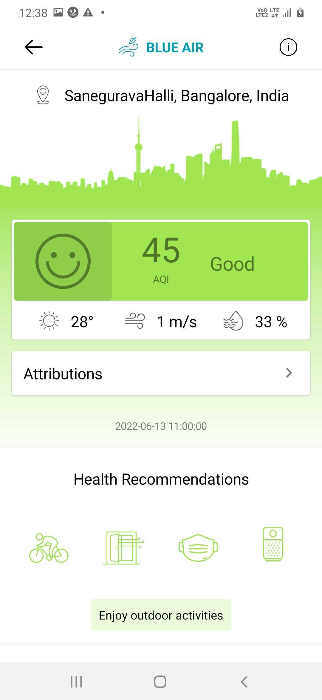
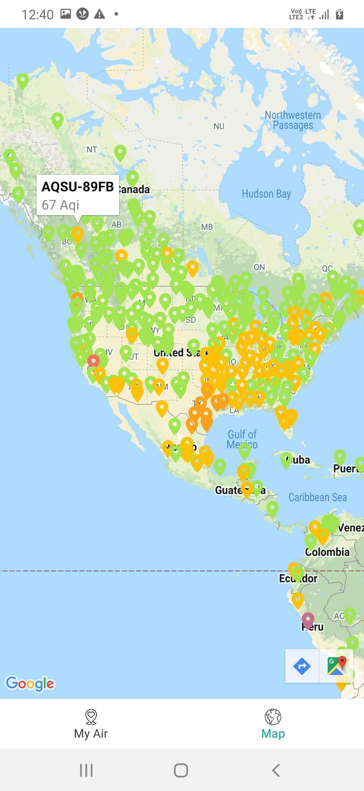
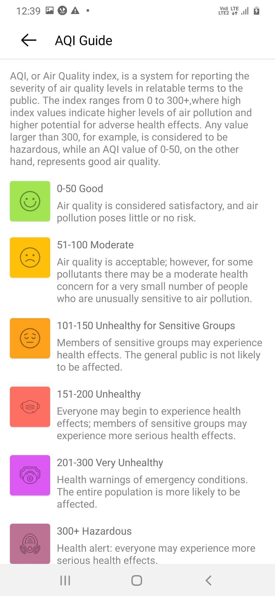
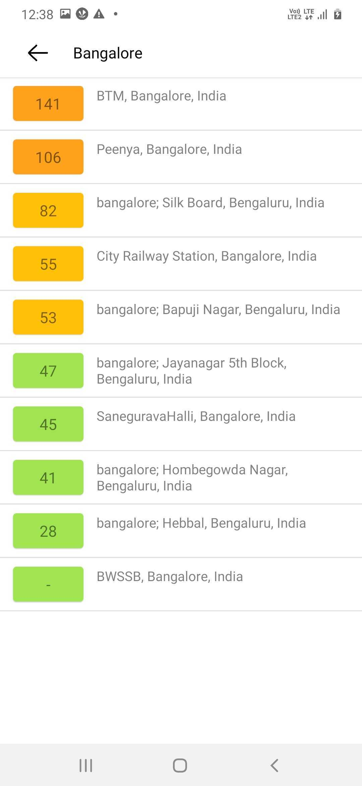
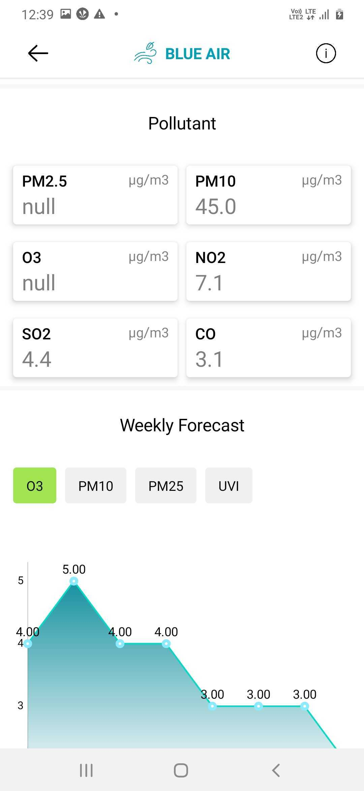
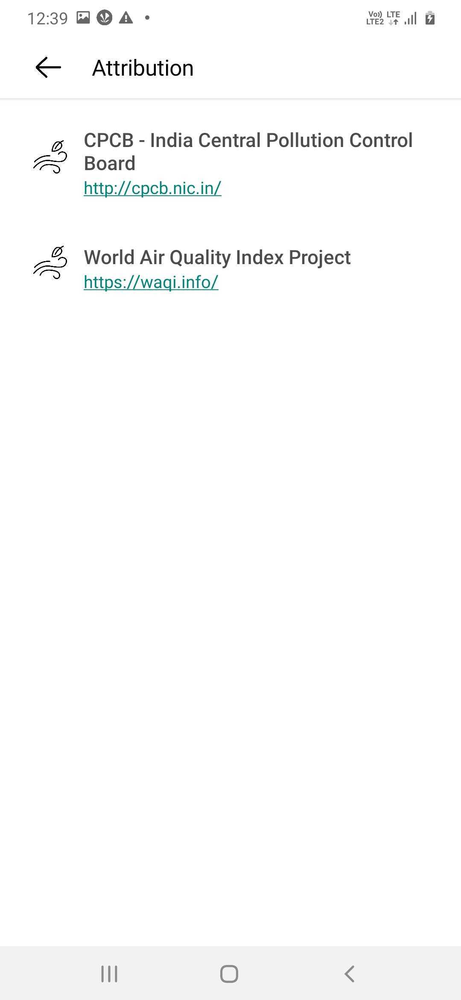
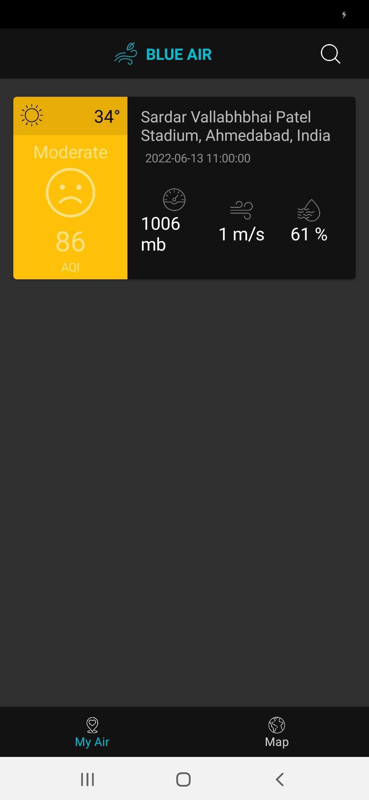
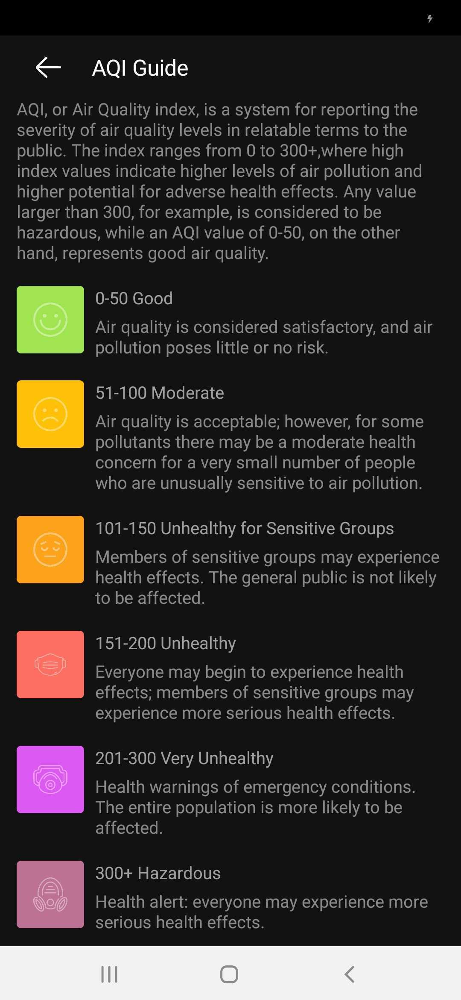
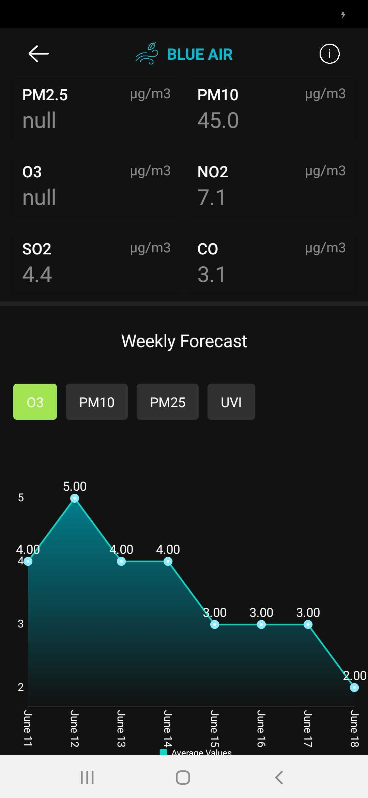
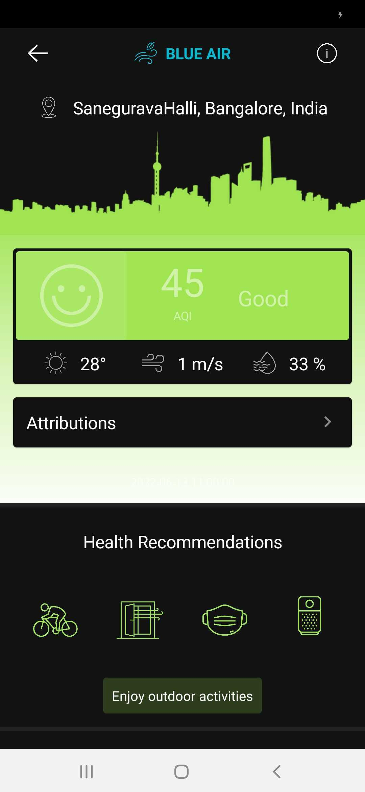
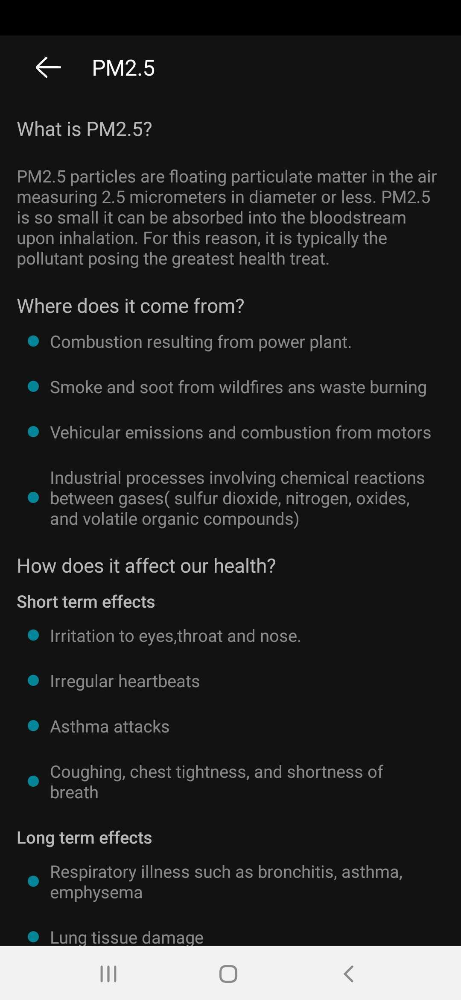

## Preview Apk

* __[Download now](https://drive.google.com/file/d/1sCmBU6oa-vfq-YUAX3oGkMZ9Hy5Bz0l4/view?usp=sharing)__

## Functionality

* Display nearest city from user's location from __[Aqicn](https://aqicn.org/api/)__
* Display all information about city
* Air Quality Chart (powered by __[PhilJay MPAndroidChart](https://github.com/PhilJay/MPAndroidChart)__ )
* Display all aqi data to Google maps
* Search by city name
* Automatic night mode (apply dark theme automatically)

## Key Settings

* To get your keys, please go on the  __[Air Quality Open Data Platform register page.](http://aqicn.org/data-platform/token/#/)__ You need to add your api_key/token to Constants.kt file
* set your google map api key to AndroidManifest.xml

## Find this repository useful? :heart:
Support it by joining __[stargazers](https://github.com/qrolic/air_quality_checker_app/stargazers)__ for this repository. :star:  